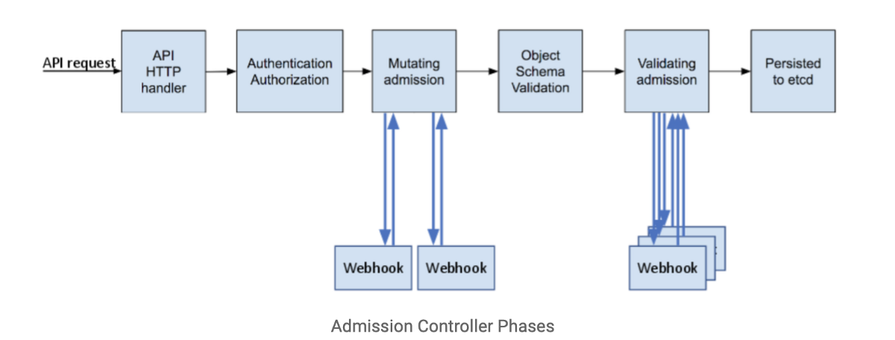

# OPA Gatekeeper breaking pod scheduling
<p align="center">
  
</p>

## Reproducing in a lab
- Prerequisites
  - [Latest RKE](https://github.com/rancher/rke/releases/tag/v1.2.7)
  - [Latest kubectl](https://github.com/kubernetes/kubectl/releases/tag/v0.20.6)
  - [Latest helm](https://github.com/helm/helm/releases/tag/v3.5.4)
  - 3 VMs (2 core, 4GB of RAM, 20GB root)
  - SSH access to root on all nodes
  - Internet access to github and docker hub.
  - Running Docker [Install Script](https://github.com/rancher/install-docker)
- Edit the cluster.yml to include your node IPs
  ```
  vi ./cluster.yml
  ```
- Stand up the cluster
  ```
  bash ./build.sh
  ```
- Verify the cluster is up and healthy
  ```
  bash ./verify.sh
  ```
- Break the cluster
  ```
  bash ./break.sh
  ```

## Identifying the issue
- Error messages in kube-scheduler logs.
  ```
  docker logs --tail 10 -t kube-scheduler
  ```
  ```
  2021-05-08T04:44:41.406070907Z E0508 04:44:41.405968       1 leaderelection.go:361] Failed to update lock: Internal error occurred: failed calling webhook "validation.gatekeeper.sh": Post "https://gatekeeper-webhook-service.gatekeeper-system.svc:443/v1/admit?timeout=3s": dial tcp 10.43.104.236:443: connect: connection refused
  ```
- The deployment will show as out-of-spec but `kubectl get pods` won't show any errors.
  ```
  kubectl get deployment/hello-world
  kubectl get pods -l app=hello-world
  ```
  ```
  NAME          READY   UP-TO-DATE   AVAILABLE   AGE
  hello-world   3/4     3            3           23m 
  NAME                           READY   STATUS    RESTARTS   AGE
  hello-world-678c699476-7h9q4   1/1     Running   0          12m
  hello-world-678c699476-dmszr   1/1     Running   0          11m
  hello-world-678c699476-f27jb   1/1     Running   0          24m
  ```

## Troubleshooting
- Find which node is currently running the kube-scheduler
  ```
  NODE="$(kubectl get leases -n kube-system kube-scheduler -o 'jsonpath={.spec.holderIdentity}' | awk -F '_' '{print $1}')"
  echo "kube-scheduler is the leader on node $NODE"
  ```
- Review the docker logs
  ```
  docker logs --tail 100 -t kube-scheduler
  ```
- Try 

## Restoring/Recovering
- Setting the failure policy to fail open.
  ```
  kubectl get ValidatingWebhookConfiguration gatekeeper-validating-webhook-configuration -o yaml | sed 's/failurePolicy.*/failurePolicy: Ignore/g' | kubectl apply -f -
  ```
- If an open policy doesn't work, remove all Gatekeeper admission checks.
  ```
  kubectl delete validatingwebhookconfigurations.admissionregistration.k8s.io gatekeeper-validating-webhook-configuration
  ```

## Preventive tasks
- Changing the failure policy to fail open. [Doc](https://open-policy-agent.github.io/gatekeeper/website/docs/failing-closed)
- [Offical OPA Gatekeeper Emergency Recovery](https://open-policy-agent.github.io/gatekeeper/website/docs/emergency)
