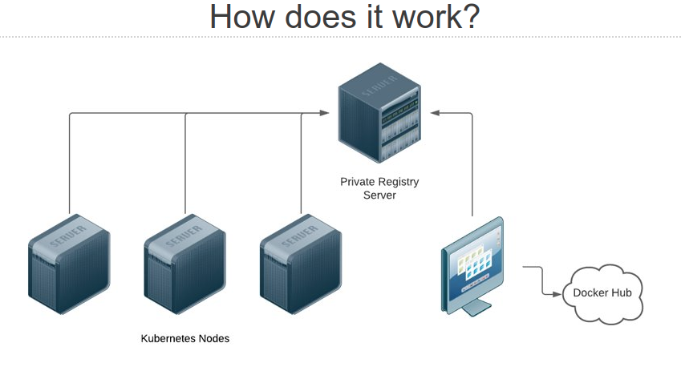

# Private registry - HA with Kubernetes



## Prerequisites​

- A Kubernetes cluster​
- A Storage Class that supports RWO or RWX​
- An external http/tcp load balancer​
- A valid ssl certicatate (If you are using an internal CA, the hosts should trust it)

NOTE: This should be deployed on an infrastructure cluster that can be bootstrapped without the private registry.

## Installation for RWX

### Deploy the namespace

```
kubectl apply -f 01-namespace.yaml
```

### Deploy the storage

NOTE: This example uses [longhorn-nfs](https://longhorn.io/docs/1.0.2/advanced-resources/rwx-workloads/) this should be changed to another storageclass that can support [RWX](https://kubernetes.io/docs/concepts/storage/persistent-volumes/#access-modes).

```
kubectl apply -f 02-pvc-rwx.yaml
```

### Deploy the configmap

```
kubectl apply -f 03-configmap.yaml
```

### Deploy the password

```
bash 04-createpassword.sh
```

or
```
htpasswd -c auth admin
kubectl -n private-registry create secret generic private-registry --from-file=auth
```

### Deploy the app

```
kubectl apply -f 05-deployment-rwx.yaml
```

### Setup the TCP load balancer

You should work with your networking/load balancer team to create a load balancer with the following settings.

- Mode: Layer 4
- Protocol: TCP
- Port: 3128
- Load‑balancing method: Round Robin
- Health check: HTTP GET / with a 200 OK

## Installation for RWO

### Deploy the namespace

```
kubectl apply -f 01-namespace.yaml
```

### Deploy the storage

NOTE: This example uses [longhorn](https://longhorn.io/) this should be changed to another storageclass that can support [RWO](https://kubernetes.io/docs/concepts/storage/persistent-volumes/#access-modes).

```
kubectl apply -f 02-pvc-rwo.yaml
```

### Deploy the configmap

```
kubectl apply -f 03-configmap.yaml
```

### Deploy the password

```
bash 04-createpassword.sh
```

or
```
htpasswd -c auth admin
kubectl -n private-registry create secret generic private-registry --from-file=auth
```

### Deploy the app

```
kubectl apply -f 05-deployment-rwo.yaml
```

### Setup the TCP load balancer

You should work with your networking/load balancer team to create a load balancer with the following settings.

- Mode: Layer 4
- Protocol: TCP
- Port: 3128
- Load‑balancing method: Round Robin
- Health check: HTTP GET / with a 200 OK

# Credit

This is based on [https://github.com/rpardini/docker-registry-proxy](https://github.com/rpardini/docker-registry-proxy)
