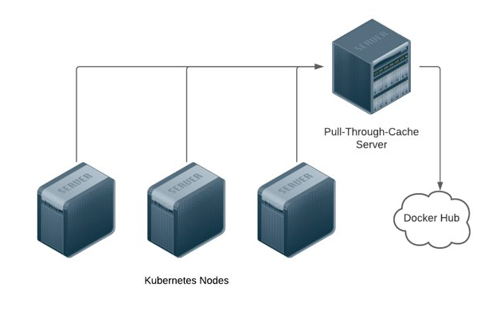

# Pull-Through-Cache - Standalone



## Prerequisites​

- Docker

NOTE: This should be deployed on an infrastructure server that can be bootstrapped without Pull-Through-Cache.

## Installation

NOTE: This should be updated with your Docker Hub login and you should try to use an [access token](https://docs.docker.com/docker-hub/access-tokens/) in-place of a password.

```
docker run --rm --name docker_registry_proxy -it \​
-p 0.0.0.0:3128:3128 \​
-v $(pwd)/docker_mirror_cache:/docker_mirror_cache \​
-v $(pwd)/docker_mirror_certs:/ca \​
-e REGISTRIES="k8s.gcr.io gcr.io quay.io your.own.registry another.public.registry" \​
-e AUTH_REGISTRIES="auth.docker.io:dockerhub_username:dockerhub_password your.own.registry:username:password" \​
tiangolo/docker-registry-proxy:latest
```

## Credit

This was based on [https://github.com/tiangolo/docker-registry-proxy](https://github.com/tiangolo/docker-registry-proxy)
